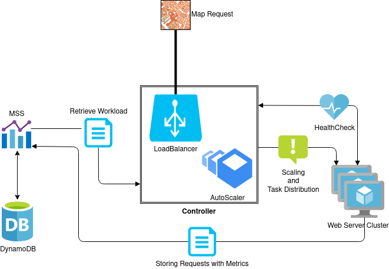

# RadarScanner@Cloud System
_Simulated radar scanning service hosted in an elastic cluster of web servers._

## Structure

| Module               |      Description      |
| :------------------- | :-------------------: |
| [BIT](BIT)     |      Custom made instrumentation tools       |
| [Controller Node](pt/ulisboa/tecnico/cnv/controller)     |  Static Server with Load Balancer and AutoScaler |
| [MSS](pt/ulisboa/tecnico/cnv/mss) |   Metrics Storage System, API for DynamoDB   |
| [Worker Node](pt/ulisboa/tecnico/cnv/server)|    Web Server   |
| [Solver](pt/ulisboa/tecnico/cnv/solver)     |      Solver Instrumented Classes       |

## Architecture



Both controller node and web server worker nodes are AWS EC2 instances, and are required to be deployed.

## WebServer and Controller Node - AWS Configuration

### EC2 Instance

1. Amazon Linux 2 AMI (Amazon Machine Image)
2. t2.micro (Instance Type)
3. Select subnet and enable CloudWatch monitoring
4. 8 GB storage
5. Security Group
    * HTTP port 80
    * Port 8000
    * SSH Port 22
6. Use our existing key pair .pem file

### Inside the machine

1. Check and install all updates
2. Install Java 7 SDK
3. Copy project directory to the instance's home directory
4. Define required CLASSPATH and disable java stackmap utilization
5. Edit rc.local for boot initialization of the WebServer, for worker node

When the steps above are completed create an image.

#### Run Worker Node
```shell
java pt.ulisboa.tecnico.cnv.server.WebServer -address 0.0.0.0 -port 8000 -maps /home/ec2-user/cnv-project/datasets
```
#### Run Controller Node
```shell
java pt.ulisboa.tecnico.cnv.controller.Server
```
## Load Balancer - AWS Configuration (Checkpoint delivery)

1. Classic Load Balancer
2. Enable VPC configuration with existing security group, port 80 open
3. HTTP 80 -> HTTP 8000
4. Basic Health Check with ping path /healthcheck on port 8000,
    * 5 seconds interval
    * 30 seconds period
    * 2 Unhealthy threshold
    * 10 Healthy threshold

## Launch Configuration - AWS Configuration (Checkpoint delivery)

1. Give name -> cnv-launchconfig
2. WebServer AMI and instance type (t2.micro)
3. Existing security group (CNV-SSH-HTTP)
4. Existing key pair

## Auto Scaling group - AWS Configuration (Checkpoint delivery)

1. Give name -> cnv-autoscalinggroup
2. Use previously create launch config
3. Select existing VPC and subnet
4. Attach to the previously created load balancer
5. ELB Health Check with 60 seconds grace period
6. Enable group metrics collection withing CloudWatch
7. Desired capactiy -> 10 | Minimum capactiy -> 10 | Maximum capactiy -> 20
8. No scaling policy

## CloudWatch Alarms - AWS Configuration (Checkpoint delivery)

1. CPUUtilization for AutoScalingGroup
2. Statistic Average
3. Period 1 minute
4. Threshold Greater than 75%
5. No notifications
6. cpu-greater-than-75 -> alarm name

Repeat the previous steps for lower than 25%

## Scaling Policies - AWS Configuration (Checkpoint delivery)

For each alarm created previously, associate it with the autoscaling group:

* Increase group size by 1 whenever the above metric surpasses 75%
* Decrease group size by 1 whenever the above metric falls bellow 25%

## Quick Request XL Test

```shell
ab -s 9999 -n 1 "http://<controller-node-ip>:8000/scan?w=2048&h=2048&x0=512&x1=1536&y0=512&y1=1536&xS=1024&yS=1024&s=GRID_SCAN&i=SIMPLE_VORONOI_2048x2048_1.png"
```

## Quick Benchmark Test

```shell
ab -n 1070 -c 10 "http://<controller-node-ip>:8000/scan?w=1024&h=1024&x0=256&x1=768&y0=256&y1=768&xS=512&yS=512&s=PROGRESSIVE_SCAN&i=SIMPLE_VORONOI_1024x1024_1.png" 
```

----
## Authors

**Group 15**

### Team members

| Number | Name              | User                                 | Email                                       |
| -------|-------------------|--------------------------------------|---------------------------------------------|
| 90704  | Andre Augusto     | <https://github.com/AndreAugusto11>  | <mailto:andre.augusto@tecnico.ulisboa.pt>   |
| 90744  | Lucas Vicente     | <https://github.com/WARSKELETON>     | <mailto:lucasvicente@tecnico.ulisboa.pt>    |
| 90751  | Manuel Mascarenhas     | <https://github.com/Mascarenhas12>    | <mailto:manuel.mascarenhas@tecnico.ulisboa.pt> |